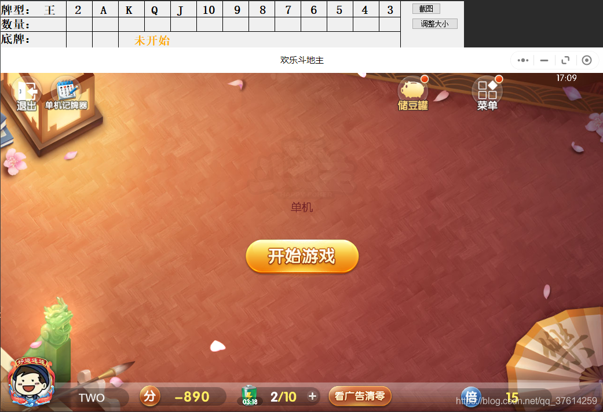
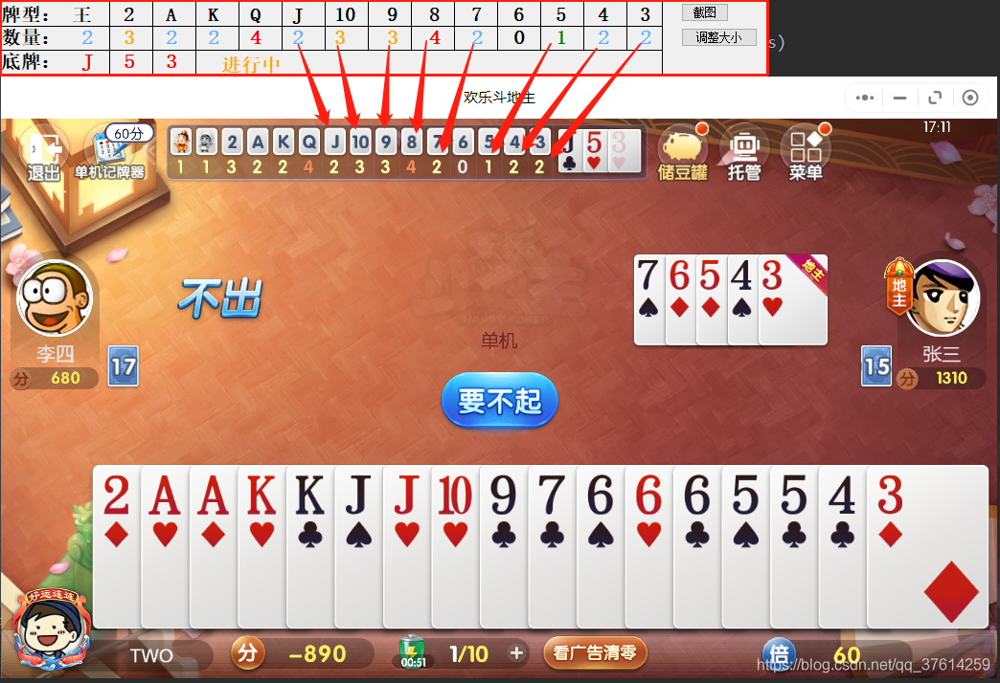
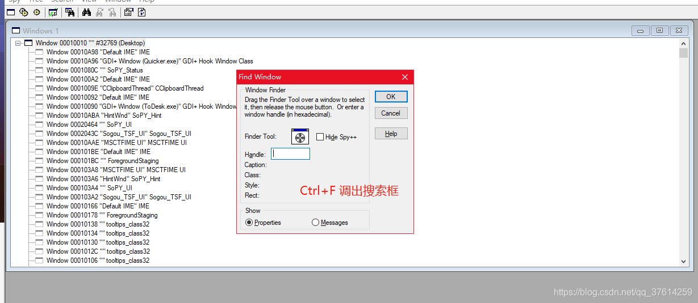
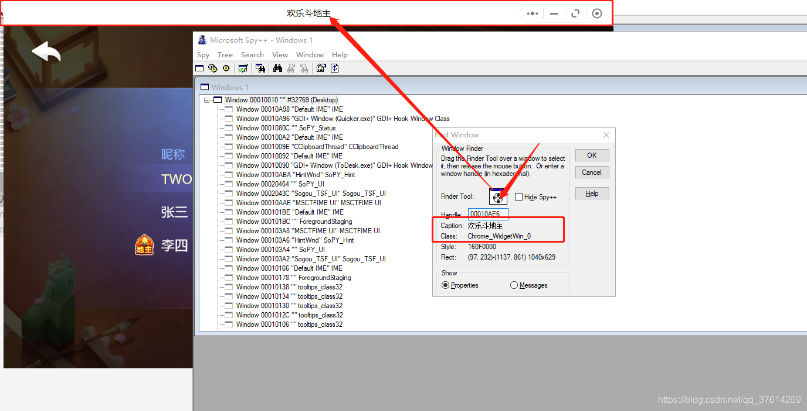
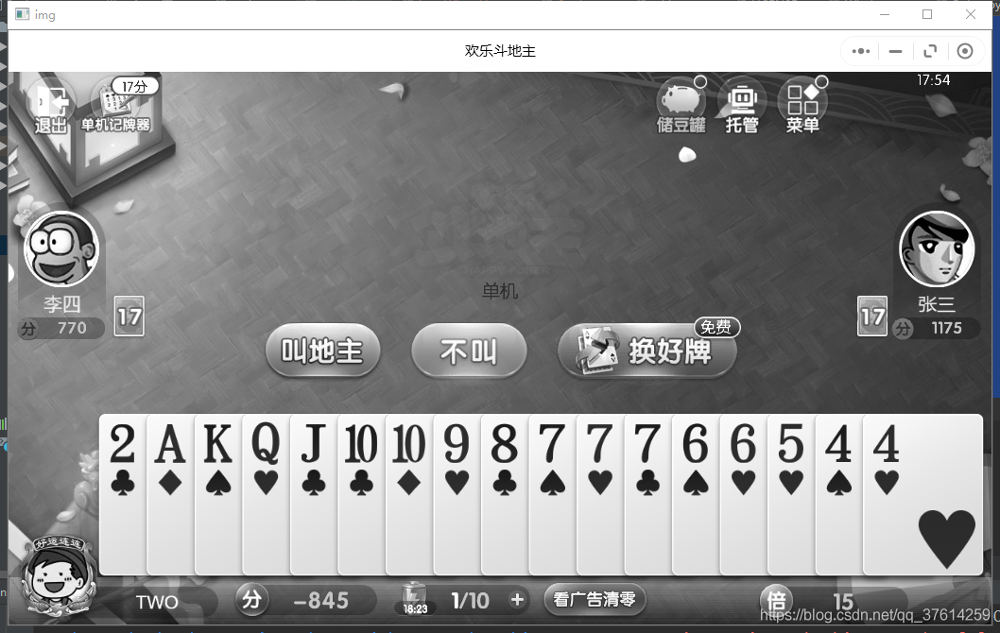
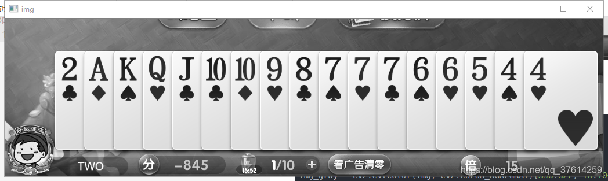
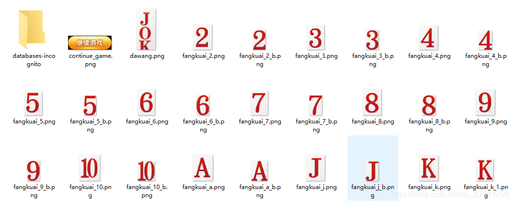
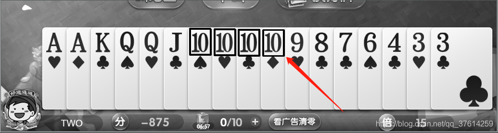

# 基于opencv的模板匹配制作的 记牌器


> !!！新版更改了截图方式（旧版截图会出现黑屏），新版截图有一点不太清晰，准确的有所下降!!!

> !!！新版更改了截图方式（旧版截图会出现黑屏），新版截图有一点不太清晰，准确的有所下降!!!

> !!！新版更改了截图方式（旧版截图会出现黑屏），新版截图有一点不太清晰，准确的有所下降!!!
 

> 基于python opencv的模板匹配制作的记牌器

> 实现思路，通过python win32获取小程序的窗口句柄，然后后台自动截屏，针对每屏进行扑克牌匹配，实现识别开局，自家扑克、底牌、上下家出牌识别，记录对局剩余扑克，自动识别游戏结束，重新统计对局

## 已实现功能

## 功能截图





## 功能视频演示

<https://v.qq.com/x/page/f32310hayxb.html>

记牌器演示 学习

## 仓库地址

[gitee](https://gitee.com/css_code/happy-fight-opencv.git "gitee"):[https://gitee.com/css\_code/happy-fight-opencv.git](https://gitee.com/css_code/happy-fight-opencv.git "https://gitee.com/css_code/happy-fight-opencv.git")

## 技术栈

-   python
-   PyQt5
-   win32gui
-   cv2

## 安装

# 安装 opencv 使用清华镜像下载

```powershell
# 安装 opencv 使用清华镜像下载
pip install python-opencv -i https://pypi.tuna.tsinghua.edu.cn/simple
pip install win32gui -i https://pypi.tuna.tsinghua.edu.cn/simple
```
## 进入正题

思考： &#x20;
1、python 如何截屏指定窗口？ &#x20;
2、想要截图的窗口不在顶层，肉眼不可见怎么办呢？

### 查看想要截图的窗口句柄





拖动Finder Tool 工具到目标窗口，得到窗口句柄caption和class，这里咱们主要用到 caption

### 获取游戏截图
```python
import win32gui, win32ui, win32con
import cv2
import numpy as np


def screen():
    hWnd = win32gui.FindWindow(None, "欢乐斗地主")
    left, top, right, bot = win32gui.GetWindowRect(hWnd)
    width = right - left
    height = bot - top
    # 窗口隐藏或最小化，无法截图
    if top < 0:
        return None
    # 返回句柄窗口的设备环境，覆盖整个窗口，包括非客户区，标题栏，菜单，边框
    hWndDC = win32gui.GetWindowDC(hWnd)
    # 创建设备描述表
    mfcDC = win32ui.CreateDCFromHandle(hWndDC)
    # 创建内存设备描述表
    saveDC = mfcDC.CreateCompatibleDC()
    # 创建位图对象准备保存图片
    saveBitMap = win32ui.CreateBitmap()
    # 为bitmap开辟存储空间
    saveBitMap.CreateCompatibleBitmap(mfcDC, width, height)
    # 将截图保存到saveBitMap中
    saveDC.SelectObject(saveBitMap)
    saveDC.BitBlt((0, 0), (width, height), mfcDC, (0, 0), win32con.SRCCOPY)
    # 保存截图
    # saveBitMap.SaveBitmapFile(saveDC, "img_Winapi.bmp")
    signedIntsArray = saveBitMap.GetBitmapBits(True)
    img = np.fromstring(signedIntsArray, dtype='uint8')
    img.shape = (height, width, 4)
    # 保存bitmap到内存设备描述表
    img = cv2.resize(img, (1040, 629), interpolation=cv2.INTER_CUBIC)
    img = cv2.cvtColor(img, cv2.COLOR_BGRA2RGB)
    # cv2.imwrite('screen.png', img)
    # 返回一张可以给opencv 使用的图片
    return img


# 调用截图方法，获取截图结果
img = screen()

# 转为灰色通道的图片
img_gray = cv2.cvtColor(img, cv2.COLOR_BGR2GRAY)
# 显示图片
cv2.imshow('img', img_gray)
# 任意键退出
cv2.waitKey(0)
```




### 截取感兴趣区域

# 调用截图方法，获取截图结果

```python
# 调用截图方法，获取截图结果
img = screen()

# 转为灰色通道的图片，截取自己的出牌区域
img_gray = cv2.cvtColor(img, cv2.COLOR_BGR2GRAY)[350:622, 10:1042]
# 显示图片
cv2.imshow('img', img_gray)
# 任意键退出
cv2.waitKey(0)
```



### 第三步，模板匹配




# 模板匹配方法

```python
# 模板匹配方法
def matchImgNum(bgImg, templeteImg, threshold=0.92):
    '''
    bgImg：截图出来的底片
    templeteImg；模板图片
    threshold：对比精确度
    '''
    res = cv2.matchTemplate(bgImg, templeteImg, cv2.TM_CCOEFF_NORMED)
    tt = bgImg.copy()
    w, h = templeteImg.shape[::-1]
    loc = np.where(res >= threshold)
    num = 0
    if len(loc[0]) != 0:
        last = 0
        # 排序
        loc[1].sort()
        for point in loc[1]:
            if abs(last - point) > 5:
                num += 1
                # if save:
                # print(save)
                for pt in zip(*loc[::-1]):
                    cv2.rectangle(tt, pt, (pt[0] + w, pt[1] + h), (0, 0, 255), 2)
                cv2.imwrite('res223.png', tt)
            last = point
    return num


# 调用截图方法，获取截图结果
img = screen()
# 转为灰色通道的图片，截取自己的出牌区域
img = cv2.cvtColor(img, cv2.COLOR_BGR2GRAY)[350:622, 10:1042]

# 读取 模板， 扑克4
temp = cv2.imread('templete/fangkuai_10.png', 0)
num = matchImgNum(img, temp, 0.85)
print('匹配出结果', num)
```

运行效果： &#x20;
匹配出结果 4 &#x20;




## 仓库地址

[gitee](https://gitee.com/css_code/happy-fight-opencv.git "gitee"):[https://gitee.com/css\_code/happy-fight-opencv.git](https://gitee.com/css_code/happy-fight-opencv.git "https://gitee.com/css_code/happy-fight-opencv.git")

## 下载尝鲜

git仓库中上传了成品文件，下载即可体验

ok，目前为止我们已经可以准确识别出自己的卡牌和数量，下一篇文章中我们将继续演示识别其他玩家的出牌和地板，以及剩余的扑克，和出牌过程中的动态修改剩余纸牌数量

模板文件我已经整理好，在代码仓库中


